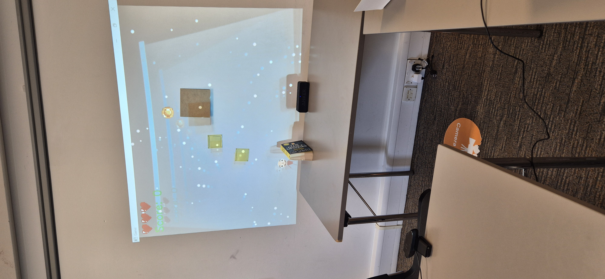
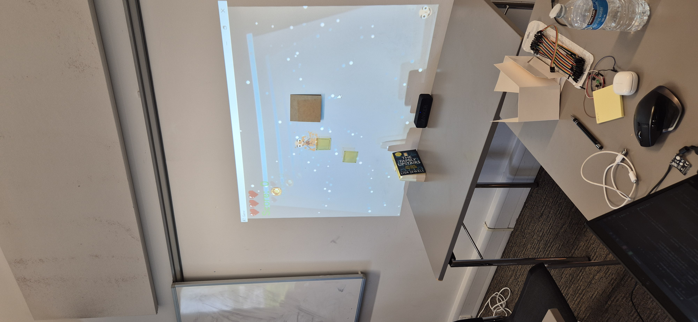
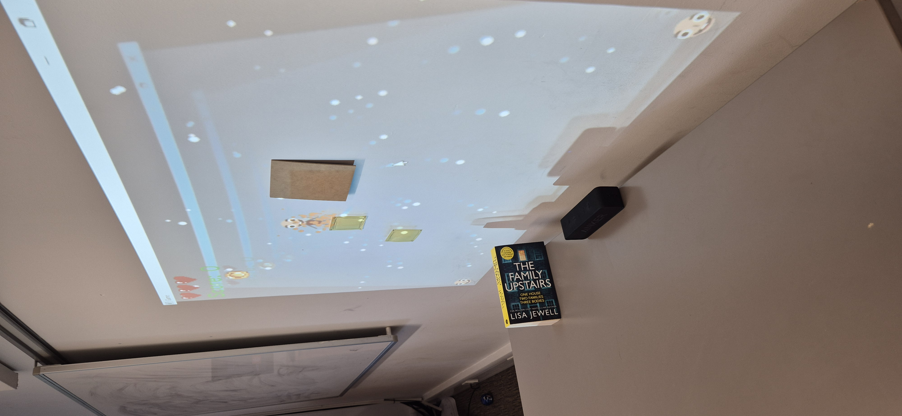

## Projector Projection Game

This is my project that won the Hackiest Hack at [Royal Hackaway V8](https://www.royalhackaway.com/) and here is my [devpost](https://devpost.com/software/projector-projection-game).

This After 24 hours, I created Projector Projection Game, a Python platform game that uses real objects for level design. The objective of the game is to find objects, such as books, sticky notes, photo frames, your arm, etc, that you can use to jump on to reach the coin.
I also managed to create a custom controller using a Pi Pico, Toggle Button, Bread Board and Dupont Cables cased in TWO empty Jammie Dodgers boxes and glued together with Royal Hackaway V8 stickers. It is managed via a serial thread and monitored on a serial port COM6 to look for incoming characters A, D and Space.
The adaptive threshold is done using the last frame, which is converted to grayscale, so CLAHE(contrast limited adaptive histogram equalisation) can be applied to make the edges of the detected items more pronounced under different lighting conditions. Gaussian blurring then smooths the image to reduce noise and minor artefacts that could otherwise lead to spurious edge detections. Canny edge detection is performed on both the blurred image and its inverted version, where it is combined using a bitwise OR to capture the broader range of edges. Morphological closing then fills the gaps in the edge map, and dilation reinforces the edges, producing an accurate mask.

The autocalibration process is done on the first 100 frames or by pressing C, and it takes the medium pixel intensity values from the grayscale-converted, blurred frames. The average is computed and adjusted by a multiplicative constant to derive adaptive lower and upper thresholds for Canny edge detection. You can choose to manually calibrate both the lower and upper values on a slider.
Contours are extracted from the edge mask to isolate detected objects and are filtered by area and enclosed in bounding rectangles which map real objects to virtual platforms.
Pressing H will show the hidden PyQT5 bar with canny thresholds, the edge detection mask and the spawn to start the game.
The boxes are overlayed onto the real world object with a projector along with the player sprite, controlled using keys a, d and space. A coin is randomly generated at the beginning and upon collision and will usually be higher up in the game environment. When a player jumps onto a platform, the top of the platform will emit particles of random colour and also when colliding with a coin or losing a heart. Do not collide with the enemies on the ground, or you will lose a life.
